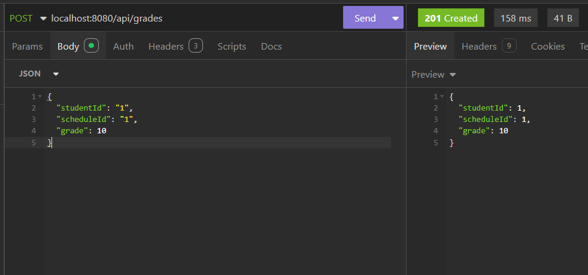
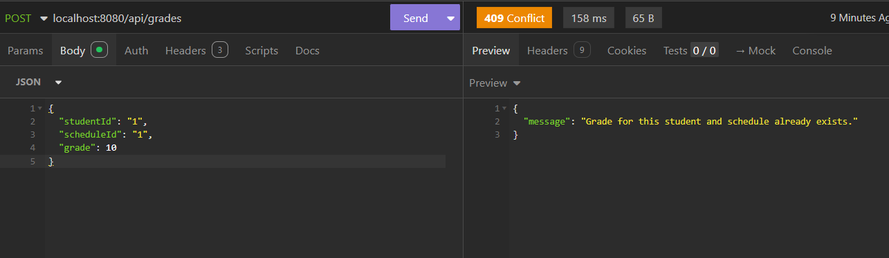
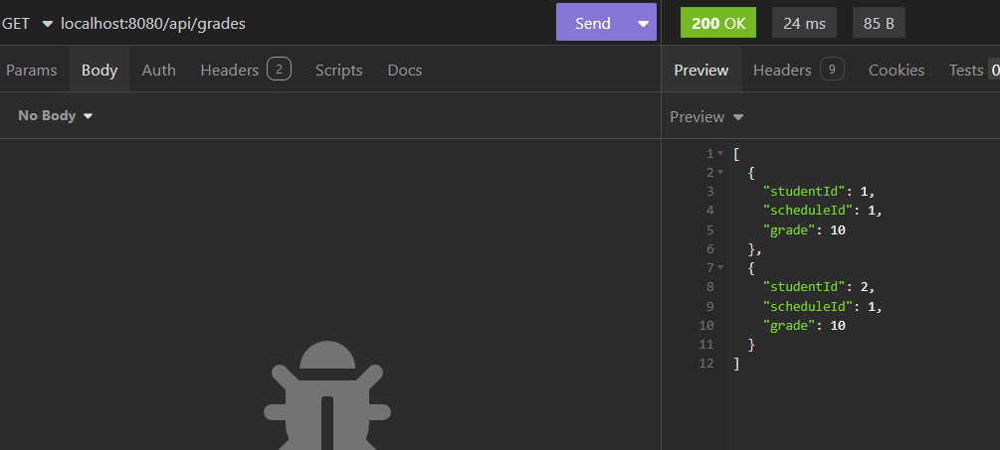

## Описание проекта

REST API для управления школьной базой данных, которое включает работу с оценками, расписанием и студентами. Проект предоставляет удобные инструменты для управления данными и обеспечивает безопасность взаимодействия с системой.

### Основные функции

- **CRUD-операции** для следующих сущностей:
    - **Grades** (Оценки)
      - POST
  
  
      - GET
        - 
    - **Schedule** (Расписание)
    - **Students** (Студенты)
- **Система аутентификации и авторизации**:
    - Используется JWT для защиты эндпоинтов.
    - Разделение прав доступа на основе ролей.
- **Валидация и обработка ошибок**:
    - Валидация входных данных на соответствие бизнес логике и ограничениям полей.

---

## Установка и запуск

### Шаги установки
1: Установите необходимые инструменты
Перед тем как запустить проект, убедитесь, что у вас установлены следующие инструменты:

Docker (https://www.docker.com/)
Docker Compose (обычно идет в комплекте с Docker).

2: Клонируйте репозиторий проекта
Клонируйте проект с GitHub или другого источника:

```bash
git clone https://github.com/non-binary-star/school-rest-api.git
```
3: Запуск приложения
Для того чтобы запустить проект с использованием Docker Compose, выполните команду:

```bash
docker-compose up --build
```
4: Проверка работы приложения
Spring Boot приложение будет доступно по адресу: http://localhost:8080.

Microsoft SQL Server будет доступен на порту 1433.

## Источники
- **https://spring.io/projects/spring-framework**
- **https://learn.microsoft.com/en-us/sql/sql-server/?view=sql-server-ver16**
- **https://docs.spring.io/spring-security/reference/index.html**
